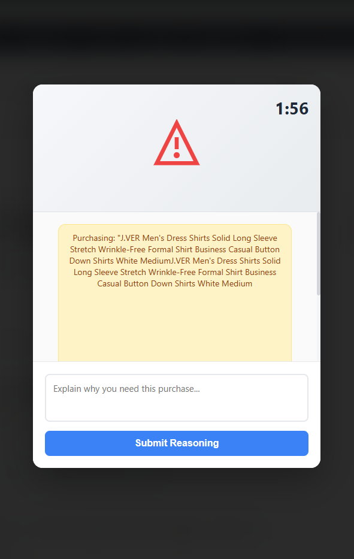

# impulse-purchase-extension(AIn’t Buying It)
Submission for HackWashU 2025. Chrome extension to prevent impulse purchases by blocking purchases and talking to AI to reason out the purchase.

**AIn’t Buying It** is a Chrome browser extension that helps users make smarter online purchasing decisions by using AI to encourage reflection, identify comparable alternatives, and track money saved over time.  
Instead of mindlessly clicking “Buy Now,” users must convince a chatbot why they need the product — and in return, the extension offers thoughtful dialogue and cost-saving suggestions.

---

## Overview

Impulse buying is easier than ever in the age of one-click checkout.  
**AIn’t Buying It** brings people and AI together to make online shopping more mindful, responsible, and financially healthy.

When you visit a checkout or product page, the extension:
1. **Intercepts** the purchase page and opens a chatbot overlay.
  
2. **Engages** the user in a short conversation about their motivation for buying.
  
3. **Finds alternatives** for the product using free, public APIs or web searches.

4. **Tracks savings and progress** over time, showing how much money the user has avoided spending impulsively.

---

## Features

### AI Reflection Chatbot
Blocks checkout until you convince the AI to let you buy — promoting mindful spending and reducing impulse purchases.

### Cheaper Alternative Finder
AI Suggests possible comparable products to compare to prevent impulse purchases and encourage healthier spending habits.

### Savings Tracker
Uses stats dashboard to store:
- **Total money saved**
- **Savings history (item and amount)**
- **Number of blocked purchases**

The data persists across sessions and can be displayed by clicking the extension icon.

### Privacy First
No personal data is uploaded or shared. All calculations and storage happen locally in your browser.

---

## How It Works

**Tech Stack**
- JavaScript (Chrome Extension APIs)
- HTML/CSS (Chatbot UI Overlay)
- Chrome `content_scripts` and `storage.local`

**Core Files**
- background.js
- config.js
- content.js
- manifest.json
- overlay-final.js
- overlay.html
- styles-new.css
- stats-db.js
- stats.css
- stats.html
- stats.js

## Setup Instructions

1. Clone or download this repository.
2. Open Chrome and navigate to `chrome://extensions/`.
3. Enable **Developer mode** (top right).
4. Click **Load unpacked**.
5. Select the folder containing `manifest.json`.
6. Visit a supported site (e.g., Amazon).
7. Watch as AIn’t Buying It intercepts the purchase flow.

---

## Example: Tracking Savings

Each time the user chooses a to deny the purchase, the extension updates totals and presents it in the dashboard.

