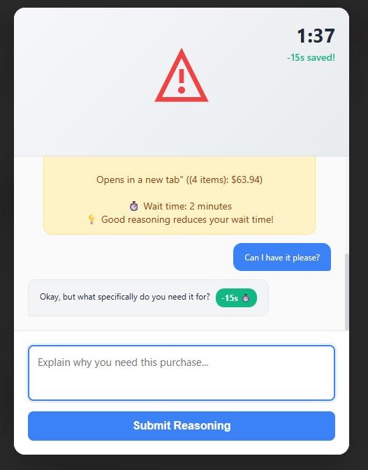
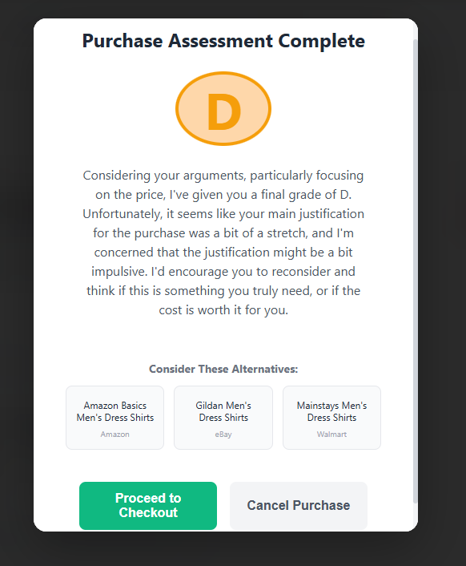
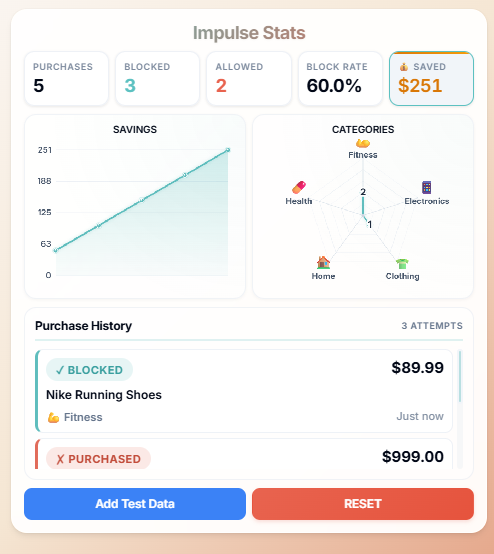

# impulse-purchase-extension(AIn’t Buying It)
Submission for HackWashU 2025. Chrome extension to prevent impulse purchases by blocking purchases and talking to AI to reason out the purchase.

**AIn’t Buying It** is a Chrome browser extension that helps users make smarter online purchasing decisions by using AI to encourage reflection, identify comparable alternatives, and track money saved over time.  
Instead of mindlessly clicking “Buy Now,” users must convince a chatbot why they need the product — and in return, the extension offers thoughtful dialogue and cost-saving suggestions.

---

## Overview

Impulse buying is easier than ever in the age of one-click checkout.  
**AIn’t Buying It** brings people and AI together to make online shopping more mindful, responsible, and financially healthy.

When you visit a checkout or product page, the extension:
1. **Intercepts** the purchase page and opens a chatbot overlay with a two-minute timer.
<p align="center">
 
</p>
3. **Engages** the user in a short conversation about their motivation for buying, where successful attempts to convince the AI decrease the timer.
<p align="center">
 
</p>
4. **Finds alternatives** for the product using AI and web searches.
<p align="center">
 
</p>
5. **Tracks savings and progress** over time, showing how much money the user has avoided spending impulsively.
<p align="center">
 
</p>
---

## Features

### AI Reflection Chatbot
Blocks checkout until the timer runs out — promoting collaboration with AI to encourage mindful spending and reduce impulse purchase habits.

### Alternative Finder
AI Suggests possible comparable products to compare to prevent impulse purchases and encourage healthier spending habits.

### Savings Tracker
Uses stats dashboard to store:
- **Total money saved**
- **Savings history (item and amount)**
- **Number of blocked purchases**
- **Categories of purchases**

The data persists across sessions and can be displayed by clicking the extension icon.

### Privacy First
No personal data is uploaded or shared. All calculations and storage happen locally in your browser.

---

## How It Works

**Tech Stack**
- JavaScript (AI APIs, database storage, and site interactivity)
- HTML/CSS (Chatbot UI Overlay)

**Core Files**
- background.js
- config.js
- content.js
- manifest.json
- overlay-final.js
- overlay.html
- styles-new.css
- stats-db.js
- stats.css
- stats.html
- stats.js

## Prerequisites

Before installing the extension, ensure you have:
- **Google Chrome** (or Chromium-based browser)
- **API Keys** (provided in the extension for development/testing)
  - Cerebras API key for chat functionality
  - Google Gemini API key for alternative product suggestions

---

## Setup Instructions

### Installation

1. Clone or download this repository:
   ```bash
   git clone https://github.com/chennethelius/impulse-purchase-extension.git
   cd impulse-purchase-extension
   ```

2. Open Chrome and navigate to `chrome://extensions/`.

3. Enable **Developer mode** (toggle in top right corner).

4. Click **Load unpacked**.

5. Select the `extension` folder containing `manifest.json`.

6. The extension icon should now appear in your Chrome toolbar.

### API Key Configuration

The extension uses two AI services:
- **Cerebras API** - Powers the conversational chatbot
- **Google Gemini API** - Generates alternative product suggestions

For development/testing purposes, API keys are included in `extension/config.js`. For production use, you should replace these with your own keys:

1. Get a Cerebras API key from [Cerebras Cloud](https://cloud.cerebras.ai/)
2. Get a Google Gemini API key from [Google AI Studio](https://makersuite.google.com/app/apikey)
3. Update the keys in `extension/config.js`:
   ```javascript
   const CONFIG = {
     CEREBRAS_API_KEY: 'your-cerebras-key-here',
     GEMINI_API_KEY: 'your-gemini-key-here',
   };
   ```

### Usage

1. Visit a supported e-commerce site (see below).
2. Navigate to a checkout or product page.
3. The extension will intercept and display an overlay with a chatbot.
4. Engage with the AI to reflect on your purchase decision.
5. View your savings statistics by clicking the extension icon.

---

## Supported Websites

The extension activates on pages with the following URL patterns:
- **Checkout pages**: URLs containing "checkout", "cart", "purchase", or "buy"
- Works on major e-commerce platforms including:
  - Amazon
  - eBay
  - Walmart
  - Target
  - Best Buy
  - And many others with standard checkout patterns

---

## Demo

Check out the `screenshots/` folder to see the extension in action:
- `exampleblock.png` - Blocked purchase page
- `examplechat.png` - AI conversation interface
- `exampleproceed.png` - Alternative suggestions
- `examplestats.png` - Savings dashboard

---

## Contributing

We welcome contributions! This project was created for HackWashU 2025, but we're excited to continue development.

### How to Contribute

1. Fork the repository
2. Create a feature branch (`git checkout -b feature/amazing-feature`)
3. Commit your changes (`git commit -m 'Add some amazing feature'`)
4. Push to the branch (`git push origin feature/amazing-feature`)
5. Open a Pull Request

### Development Guidelines

- Test your changes on multiple e-commerce sites
- Ensure the overlay doesn't break legitimate browsing
- Keep the UI responsive and accessible
- Document any new features in the README

---

## Troubleshooting

### Extension Not Loading
- Ensure Developer Mode is enabled in Chrome
- Check that you selected the `extension` folder (not the root folder)
- Look for errors in `chrome://extensions/`

### Overlay Not Appearing
- Verify you're on a checkout/cart page with relevant URL patterns
- Check the browser console for errors (F12 > Console)
- Ensure the extension is enabled in `chrome://extensions/`
- If you've already been blocked in the same tab within 5 minutes, open a new tab

### API Errors
- Verify your API keys are correctly configured in `config.js`
- Check your internet connection
- Ensure you haven't exceeded API rate limits

### Chatbot Not Responding
- Check the browser console for network errors
- Verify the Cerebras API is accessible
- Try refreshing the page

### Statistics Not Saving
- Check Chrome's storage permissions for the extension
- Verify you're clicking "Not Buy" or "Continue" to save data
- Clear browser cache if data appears corrupted

---

## Technical Details

### Tech Stack
- **Frontend**: HTML5, CSS3, JavaScript (ES6+)
- **AI Services**: 
  - Cerebras API for conversational AI
  - Google Gemini API for product alternatives and web searches
- **Storage**: Chrome Storage API (local persistence)
- **Architecture**: Chrome Extension Manifest V3

### Core Components

| File | Purpose |
|------|---------|
| `background.js` | Service worker for extension lifecycle management |
| `config.js` | API keys and configuration constants |
| `content.js` | Content script to detect and block purchase pages |
| `overlay-final.js` | Main overlay logic, AI integration, and chat functionality |
| `overlay.html` | Chatbot UI structure |
| `styles-new.css` | Overlay styling |
| `stats-db.js` | Database operations for savings tracking |
| `stats.html` | Statistics dashboard layout |
| `stats.js` | Statistics dashboard logic and data visualization |
| `stats.css` | Statistics page styling |
| `manifest.json` | Extension configuration and permissions |

### How It Works

1. **Content Script Injection**: When you visit a page, `content.js` checks the URL for checkout-related patterns
2. **Page Blocking**: If a pattern matches, the script extracts product information and injects the overlay
3. **AI Conversation**: `overlay-final.js` manages the chat interface and communicates with Cerebras API
4. **Timer Management**: A 2-minute countdown runs, but can be reduced by convincing the AI
5. **Alternative Search**: After the conversation, Gemini API finds comparable alternatives
6. **Data Persistence**: Purchase decisions and savings are stored using `stats-db.js`
7. **Statistics Dashboard**: Click the extension icon to view your savings history

---

## Future Improvements

- [ ] Support for more e-commerce platforms with custom extractors
- [ ] Browser extension support (Firefox, Edge)
- [ ] Customizable timer duration
- [ ] Weekly/monthly savings reports via email
- [ ] Social features (share savings achievements)
- [ ] Machine learning to improve alternative suggestions
- [ ] Budget goal setting and tracking
- [ ] Integration with personal finance apps
- [ ] Multilingual support
- [ ] Dark mode for overlay and stats dashboard
- [ ] Export savings data (CSV, JSON)

---

## Team

Created for **HackWashU 2025** by:
- Max Chen ([@chennethelius](https://github.com/chennethelius))
- Noah Wolk

---

## License

This project is licensed under the **MIT License** - see the [LICENSE](LICENSE) file for details.

---

## Acknowledgments

- Built with ❤️ at HackWashU 2025
- Powered by Cerebras and Google Gemini AI
- Inspired by the need for mindful spending in the digital age

---

## Contact

For questions, suggestions, or issues:
- Open an issue on [GitHub](https://github.com/chennethelius/impulse-purchase-extension/issues)
- Repository: [impulse-purchase-extension](https://github.com/chennethelius/impulse-purchase-extension)

---

**Remember: The best purchase is the one you don't make impulsively!** 🛡️💰


